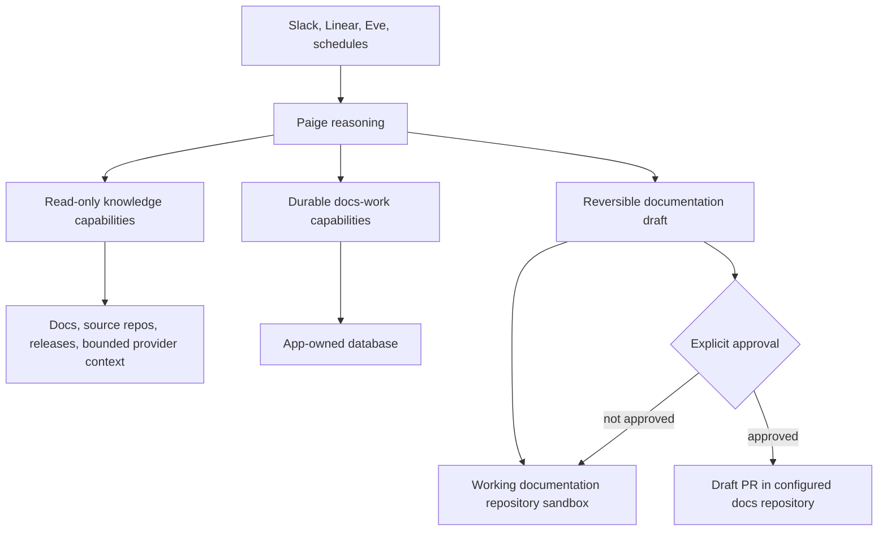

# Paige Capability Architecture Refactoring Plan

Status: Accepted architecture; tracked by #78; execution pending
Created: 2026-07-13
Last Refreshed: 2026-07-14
Scope: Agent runtime, knowledge and repository capabilities, durable docs work,
behavioral proof, and the operator control plane.

## Purpose

Paige should become a general knowledge and documentation agent for a software
team. It should be able to answer product and documentation questions from
attributable workspace evidence, combine bounded capabilities into useful
operational workflows, and turn a confirmed documentation gap into a checked,
reversible draft.

The agent should not become a general-purpose operator. Documentation remains
its only mutable product domain. Source repositories, watched repositories,
provider conversations, workspace memory, and web results remain evidence.
External publication remains separately approval-gated.

This plan replaces workflow-shaped model tools with a smaller
policy-constrained capability kernel. Workflows belong in agent reasoning,
load-on-demand skills, durable work state, and behavioral evals. Tools should
represent reusable capabilities or real authority boundaries.

## Desired Product Contract

> Paige answers product and documentation questions from current,
> attributable workspace knowledge. When the answer reveals a documentation
> problem, Paige can investigate, recommend an intervention, prepare and
> validate a reversible draft, and publish it only after explicit approval.

That contract implies three first-class outcomes:

1. answer the question with sources and uncertainty;
2. conclude that no documentation action is needed;
3. continue into documentation work when the evidence supports it.

A docs signal, impact report, content plan, or patch is not required for every
useful interaction. These remain durable domain artifacts when the work needs
them.

## Architecture Thesis

The runtime, not prompt choreography, enforces:

- which sources can be read;
- which repository can be changed;
- which paths and operations are allowed;
- which network destinations are reachable;
- which durable state transitions are valid;
- which caller or channel can see a capability;
- which external side effects require approval.

## Current Evidence

The current implementation already contains much of the right substrate:

- raw Eve `bash`, `glob`, `grep`, `read_file`, and `write_file` tools are
  disabled;
- sandbox egress is limited to the GitHub and package-manager domains required
  by repository work;
- repository operations validate allowed actions and repository-relative paths;
- `authoring_workspace` supports reversible multi-file text and binary writes,
  copies, moves, deletions, inspection, checks, and diff preparation;
- `publish_working_repository_pr` is the only writeback capability and requires
  approval on every call;
- Slack context retrieval, workspace memory, source evidence, and current docs
  already have explicit trust boundaries;
- setup, signals, memory, approvals, runs, and assurance use app-owned typed
  services rather than prompt-only state;
- #63 completed the stable capability contract and checked migration inventory;
- #58, #59, and their implementation issues #64-#75 completed watch policy,
  lifecycle, Slack admission, deduplication, bounded windows, and dispatch
  readiness without adding a watch-specific workflow tool;
- #76 added the general `internal_document` primitive under
  `docs_work.manage`, with bounded revisions, typed attachments, retention,
  provenance, idempotency, optimistic concurrency, and behavioral proof.

The remaining architectural debt is in the model-facing surface:

- repository work is split across preparation tools, five `repo_*` tools,
  `prepare_docs_signal_patch`, and `authoring_workspace`;
- `prepare_docs_signal_patch` retains a one-file exact-replacement contract
  after multi-file authoring became the general path;
- all authored tools are static; channel-only, schedule-only, setup-only, and
  publication capabilities remain ambient in unrelated turns;
- context repositories exist in the schema and architecture language but not as
  a general read-only knowledge capability;
- the control plane describes named workflow objects but cannot yet explain the
  effective capabilities and evidence sources available to a given surface;
- several evals prove an exact orchestration path rather than the desired
  behavior and authority invariants.

ADR-0004 now establishes policy-bound watches as the provider-neutral primitive
for proactive attention. Its core decision matches this plan: a bounded natural
language goal may guide model judgment and capability composition, while typed
runtime policy owns provider scope, admitted events, actions, retention,
budgets, delivery, lifecycle, expiry, and approval. The M5 watch epic (#57
through #62) is therefore part of the target architecture, not a parallel
workflow system.

The committed EditorJS manual Slack scenario is evidence for the target
direction. It deliberately uses the generic authoring path instead of adding a
third hard-coded runtime fixture. Promote it into executable behavioral proof
during this program.

The refreshed validation baseline is 35 authored tools, 12 framework tools,
and 36 discovered Eve eval cases. `pnpm capability:check` passes. The authored
tool surface remains static: the landed watch capability registry constrains
policy and dispatch readiness, but it does not yet resolve Eve tools by
channel, principal, setup, or work state.

## Non-Negotiable Invariants

Every slice in this plan must preserve these rules.

1. The configured working documentation repository is the only mutable
   repository.
2. Watched, context, and source repositories are read-only evidence.
3. Raw shell and unrestricted filesystem tools remain unavailable to the model.
4. The sandbox keeps an explicit network allowlist and denies private subnets.
5. Secrets stay in the app runtime or credential broker, never in model context,
   durable artifacts, or the sandbox filesystem.
6. Public documentation claims require source evidence plus inspection of the
   current docs when relevant.
7. Slack search results and workspace memory are routing context, not proof of a
   public product claim.
8. Reversible sandbox drafting does not require approval.
9. Every external write is a dedicated capability with an explicit approval and
   authorization policy. GitHub publication remains approval-gated on every
   call.
10. Required integrations and persistence fail visibly. No fail-open stub,
    process-memory substitute, fake success, or silent fallback may be added.
11. Runtime code rechecks authority at execution time even when dynamic tool
    visibility has already hidden an unavailable capability.
12. `pnpm check` remains the fast affected-package gate and
    `pnpm check:full` remains the complete repository handoff gate.
13. Behavior changes receive live Eve eval coverage; deterministic checks do
    not substitute for model-behavior proof.
14. Any pre-existing dirty worktree is user-owned and must be preserved.

## Capability Design Rules

### Group by resource and authority

Group operations when they act on the same resource with the same authorization
and trust boundary. A discriminated-union tool can expose several coherent
modes such as list, search, read, status, and diff.

Do not create one omnipotent `execute`, `http`, `shell`, or generic mutation
tool. Provider-specific authorization, privileged lifecycle changes, and
external side effects remain separate capabilities.

### Keep workflows out of executable tool implementations

Tools may perform an atomic domain operation, including all enforcement needed
to make that operation safe. They should not encode a particular customer
scenario, prompt transcript, expected editorial judgment, or end-to-end agent
journey.

Skills may describe procedures. Evals may provide scenarios. Durable work state
may preserve progress. The model chooses how to compose capabilities within
those boundaries.

### Prefer runtime policy to prompt policy

Prompt guidance may explain why a boundary exists, but code must enforce paths,
actions, source access, output limits, lifecycle transitions, approval,
authorization, and idempotency.

### Keep tool output bounded and provenance-bearing

Read tools must support limits, pagination or continuation, path filters, and
compact model projections. Every returned fact should retain enough source
identity to distinguish current docs, source code, releases, provider context,
web results, and workspace memory.

### Avoid permanent compatibility surfaces

Compatibility wrappers are allowed only inside a bounded migration slice. Each
wrapper must name its remaining consumer and removal condition. Do not leave
old and new model-facing tools visible together after the consumer migration is
complete.

## Target Model-Facing Surface

ADR-0006 records the stable capability-family identifiers. Model-facing tool
names remain implementation details, but the target responsibilities are:

### Workspace knowledge

A read-only capability for listing configured sources, searching them, and
reading bounded evidence. It should cover the working docs repository, watched
repositories, later context repositories, and normalized release/source
records. Provider-bound searches such as Slack remain separate when their token
or privacy model requires it.

### Working repository

A policy-aware, read-oriented capability for materialization, listing, search,
read, status, diff inspection, and named checks. It operates only on the
configured working documentation repository and records action provenance.

### Documentation draft

`authoring_workspace` remains the canonical reversible mutation surface. It
owns batched changes, optimistic concurrency, draft inspection, validation,
abandonment, and the prepared diff. It may link to a docs signal, substantial
work record, editorial recommendation, or content plan without requiring a
separate patch implementation.

### Durable docs work

A small resource-oriented read and mutation surface owns docs signals,
milestones, recommendations, plans, follow-ups, corrections, blockers,
artifacts, and terminal outcomes. Provider capture remains responsible for
creating provider provenance. Publication remains separate.

### Workspace memory

Memory stays separate from source evidence and docs work because its trust and
human-governance lifecycle differ. Rationalize its model-facing reads and
mutations only when that can be done without weakening provenance or review.

### External side effects

Publishing and any future provider mutation stay dedicated, narrow, authorized,
idempotent, auditable, and approval-gated as appropriate. No generic connection
write surface is part of this program.

## Effective Capability Matrix

Dynamic capability resolution should converge on this shape. Exact tool names
remain intentionally independent from the stable identifiers recorded by CR0.

| Context | `knowledge.read` and `repository.read` | `docs_work.manage` | `draft.edit` | Provider intake/retrieval | `follow_up.schedule` | `publication.publish` |
| --- | --- | --- | --- | --- | --- | --- |
| Unconfigured ordinary conversation | Model/web answer with stated limits | No | No | Channel-specific only | No | No |
| Configured interactive Eve turn | Yes | Yes | When requested | No | No | Only for a prepared draft and authorized caller |
| Slack mention or enrolled thread | Yes | Yes | When setup and user request permit | Slack only | No | Only after explicit approval |
| Linear Agent Session | Yes | Yes | When setup and user request permit | Linear only | No | Only after explicit approval |
| Daily schedule principal | Yes | Due-work updates only | Reversible work only when explicitly in schedule scope | No | Yes | No |
| Approval resume | Minimum needed to revalidate the pending operation | Relevant record only | Prepared draft inspection | No | No | Pending approved call only |

Capability visibility is defense in depth. Every capability must still enforce
auth, setup, lifecycle, and repository policy inside `execute`.

## Program Queue

Tracked by #78. GitHub issues are the implementation source of truth.

| Order | Slice | Outcome | Depends on | Status |
| --- | --- | --- | --- | --- |
| CR0 | Record the architecture contract and migration inventory | One accepted capability model and checked migration inventory | None | Complete in #63 |
| CR1 / #79 | Remove fixture workflows from the production tool surface | Runtime behavior no longer depends on Saleor-specific scenario code | CR0 | Complete in #79 |
| CR2 / #80 | Build the read-only working-repository capability kernel | One composable repository inspection surface | CR0, CR1 | Ready |
| CR3 / #81 | Converge all documentation mutation on `authoring_workspace` | One reversible, concurrency-safe draft path | CR2 | Pending CR2 |
| CR4 / #82 | Add a workspace knowledge source registry and context repositories | General, provenance-bearing read access across configured sources | CR2 | Pending CR2 |
| CR5 / #83 | Make knowledge answers a first-class agent behavior | Paige can answer, abstain, or continue into docs work | CR4 | Pending CR4 |
| CR6 / #84 | Rationalize durable docs-work capabilities | One coherent work resource instead of workflow-specific state tools | CR3, CR4 | Foundation landed in #76; consolidation pending |
| CR7 / #85 | Resolve capabilities dynamically by channel, principal, setup, and work state | Irrelevant and privileged tools are not ambient | CR2, CR3, CR4, CR6 | Watch policy foundation landed in #64-#75; Eve resolution pending |
| CR8 / #86 | Reframe instructions, skills, and public product docs | Model context and product language match the new contract | CR5, CR7 | Pending CR5 and CR7 |
| CR9 / #87 | Align the control plane with sources, capabilities, and drafts | Operators can understand effective authority and evidence | CR4, CR6, CR7 | Pending CR4, CR6, and CR7 |
| CR10 / #88 | Complete behavioral proof and remove compatibility seams | No legacy workflow surface or unproved capability remains | CR1-CR9 | Pending CR1-CR9 |

## Relationship To M5 Policy-Bound Watches

This plan does not replace ADR-0004 or duplicate issues #57-#62. The watch epic
is the first major consumer of the capability architecture and should migrate
with it deliberately.

| Watch work | Capability-refactor relationship |
| --- | --- |
| #58 Persist a bounded watch contract | Complete. Supplies typed policy, lifecycle, audit, budget, and expiry inputs to CR6 and CR7. |
| #59 Admit configured Slack events | Complete. Supplies provider-specific admission, normalized observations, deduplication, bounded windows, and dispatch readiness to CR4 and CR7. |
| #60 Execute watch goals | Must consume the canonical knowledge, repository, draft, and docs-work capabilities from CR2-CR7. Avoid building permanent adapters around the current fragmented tool surface. |
| #61 Configure and govern watches | Aligns with CR9. Reuse shared policy services and operator identity rather than building a separate watch admin boundary. |
| #62 Prove release and docs-feedback scenarios | Supplies CR5 and CR10 behavioral proof that different goals use one runtime and generic capabilities. Assertions should target outcomes and policy boundaries. |
| #76 Add durable internal working documents | Complete. Supplies the canonical general document primitive within `docs_work.manage`; CR6 must preserve it rather than add another document or journal surface. |
| #77 Preserve watch findings across sessions | Consumes #76 through the watch-execution skill and #60 runtime; it must not define a separate authority or persistence path. |

Recommended sequencing:

1. Treat CR0, #58, #59, and #76 as completed foundations.
2. Land CR1 and CR2 first, then advance CR3 and CR4 from the canonical
   repository surface.
3. Land CR5 and CR6 before CR7; preserve `internal_document` as the general
   durable-document primitive while consolidating the remaining docs-work
   tools.
4. Finalize #60 and #77 only against the CR2-CR7 capabilities so watch
   execution does not institutionalize compatibility wrappers.
5. Converge #61 with CR9 and #62 with CR10 instead of implementing duplicate UI
   or eval slices.

## CR0: Record The Architecture Contract And Behavioral Baseline

### Goal

Turn the thesis in this plan into an agreed technical contract before changing
runtime behavior.

### Scope

- Treat accepted ADR-0004 as a binding input for policy-bound proactive
  attention.
- Decide whether the broader knowledge-and-documentation capability kernel
  needs a narrow follow-up ADR or can be recorded by linking and extending the
  existing architecture contract without duplicating ADR-0004.
- Ensure the durable decision set covers:
  - workspace-scoped product knowledge as Paige's general remit;
  - documentation as the only mutable domain;
  - capabilities in tools, workflows in skills/evals/state;
  - resource-and-authority-based tool grouping;
  - deterministic dynamic capability resolution;
  - continued prohibition on raw shell and arbitrary provider mutation.
- Inventory every current authored and framework tool from Eve's compiled
  manifest.
- Classify each tool as:
  - keep as an authority boundary;
  - merge into a resource capability;
  - make dynamic;
  - move to eval-only support;
  - remove.
- Include the planned watch surfaces from #58-#62 in the inventory so the
  refactor does not delete a required authority boundary or create duplicate
  model-facing tools.
- Record consumers, tests, durable state, control-plane projections, and removal
  conditions for every tool marked for migration.
- Preserve the existing behavioral suites and keep live or external proof
  requirements on their owning issues without weakening assertions.
- Decide stable target names for the capabilities described above.

### Deliverables

- ADR-0004 plus a linked follow-up decision only if the broader capability
  contract contains a genuinely separate consequential decision.
- A checked capability-surface inventory derived from
  `.eve/compile/compiled-agent-manifest.json`, not a hand-maintained count.
- A migration table in `docs/internal/WORKFLOWS.md` or a directly linked
  internal architecture document.
- A documented behavioral-proof boundary for general conversation,
  docs-needed, no-change, Slack, Linear, watched-repository, memory, authoring,
  and approval behavior.

### Acceptance

- The contract distinguishes generic knowledge assistance from arbitrary
  operational authority.
- Every current tool has a named destination and removal condition.
- Open issue #32 remains a behavior-preserving instruction refactor and is not
  expanded to absorb this product change.
- External-proof blockers on #32 and #37 remain visible and separate.
- Issues #57-#62 have an explicit implementation relationship to CR0-CR10 and
  do not create purpose-specific workflow tools.

### Proof

- Focused architecture/document checks.
- `pnpm check`.
- `pnpm eval --list` plus the runnable baseline suites.
- A recorded explanation for any live suite blocked by missing real connectors.

## CR1: Remove Fixture Workflows From The Production Tool Surface

### Goal

Stop exposing deterministic user-test fixtures as if they were general agent
capabilities.

### Scope

- Remove `run_docs_maintenance_scenario` from the model-facing runtime.
- Move `docs-maintenance-scenarios.ts` and its Saleor-specific keyword detection,
  target paths, expected text, replacement text, and expected reports under
  eval fixtures or deterministic test support.
- Rewrite `saleor-docs-user-tests.eval.ts` so the agent composes repository and
  authoring capabilities.
- Replace exact `configure -> terminal scenario tool` assertions with outcome
  and authority assertions.
- Preserve deterministic unit coverage for the two historical fixtures without
  making fixture answers available to the production model.
- Promote the existing EditorJS Slack scenario into live proof of an unseen,
  source-backed docs gap.
- Add at least one repository-generic no-change case that cannot match the old
  Saleor keywords.

### Acceptance

- No production source contains customer-scenario keyword routing or hard-coded
  editorial answers.
- The model can complete the original docs-needed and no-change cases through
  reusable capabilities.
- The EditorJS case uses the same generic runtime path without special-case
  implementation.
- Evals still prove that no writeback occurs without approval.

### Proof

- Deterministic fixture tests.
- Live docs-needed, no-change, and EditorJS behavioral evals.
- A repository search proving `run_docs_maintenance_scenario` is absent from
  production instructions, skills, tools, and workflow docs.
- `pnpm check`.

## CR2: Build The Read-Only Working-Repository Capability Kernel

### Goal

Give Paige enough safe repository freedom to investigate unfamiliar docs work
without raw shell access or a collection of historical workflow tools.

### Scope

- Introduce one resource-oriented working-repository capability with bounded
  modes for:
  - ensure/materialize configured checkout;
  - list files by safe pattern and path prefix;
  - search literal or regular-expression text with result limits;
  - read text with line ranges and output limits;
  - inspect repository status and the current draft diff;
  - run named, policy-approved validation checks.
- Keep setup mutation separate from repository inspection.
- Make repository materialization implicit on the first repository operation
  after setup rather than a tool-routing burden.
- Reuse one internal policy service for path validation, action authorization,
  output truncation, provenance, and sandbox access.
- Make `get_docs_profile` consume the same list/read/search service instead of
  issuing its own ad hoc discovery commands.
- Replace and remove the model-facing forms of:
  - `prepare_working_repository`;
  - `prepare_configured_working_repository`;
  - `repo_read_file`;
  - `repo_search`;
  - `repo_run_checks`;
  - `repo_export_diff`.
- Keep `repo_replace_text` until CR3 migrates mutation.

### Safe validation commands

The model must not supply arbitrary shell commands. Replace the fixed global
check enum with repository-owned named validators:

- discover candidate package scripts and documented checks;
- persist or cache a typed validation profile with its sources;
- require operator or trusted setup ownership for commands that become
  executable policy;
- let the model request only validator ids;
- always keep internal diff integrity checks available;
- record command, exit code, bounded output, and provenance in the result.

### Acceptance

- Paige can explore an unfamiliar repository tree without knowing exact paths
  in advance.
- Every operation stays under the configured working repository.
- Result size and search breadth are bounded.
- No input field can inject an arbitrary command or escape the repository.
- Old preparation and read-oriented `repo_*` tools are no longer visible.

### Proof

- Unit tests for absolute paths, `..`, backslashes, control characters,
  symlinks, invalid globs, regex failures, output limits, and action denial.
- Tests for validator discovery, operator ownership, unknown ids, failed
  commands, and bounded output.
- Live eval showing the model discovers and reads an initially unknown page.
- Compiled-manifest assertion for the new surface and removed tools.
- `pnpm check`.

## CR3: Converge All Documentation Mutation On `authoring_workspace`

### Goal

Make one reversible draft capability serve localized patches, multi-file work,
signal-backed work, corrections, and validation.

### Scope

- Add optional `signalId`, owned-work reference, editorial recommendation, and
  content-plan linkage to the draft contract.
- Route signal-backed lifecycle events and artifacts from the prepared draft
  instead of using a separate patch implementation.
- Replace exact-replacement-only patch handoff with ordinary authoring
  operations.
- Remove model-facing `repo_replace_text` and `prepare_docs_signal_patch` after
  their consumers migrate.
- Keep small changes plan-free and require a ready content plan only for the
  existing substantial-work conditions.
- Preserve `focused-patch`, `new-document`, `rewrite`, `restructure`,
  `consolidate`, `remove`, and no-change editorial outcomes.

### Concurrency and atomicity hardening

- Require an expected content hash or explicit create-only intent for writes,
  moves, copies, and deletions of existing paths.
- Preflight every operation in a batch before changing files.
- If execution fails after preflight, restore the exact pre-call draft state
  without discarding valid edits from earlier calls.
- Reject stale base revisions before mutation and again before preparation.
- Preserve a structured operation result instead of only a cumulative count.
- Keep binary size limits and add total batch limits.
- Make abandonment idempotent and explicit about which draft state it resets.

### Acceptance

- One code path prepares every documentation draft.
- A localized signal patch can be prepared without `content_plan`.
- Substantial work cannot draft against a missing, blocked, or unrelated plan.
- Partial failures do not leave an ambiguous half-applied batch.
- Publication consumes only the prepared draft and its recorded checks.

### Proof

- Deterministic tests for create, update, copy, move, delete, binary, stale
  hashes, stale base, batch rollback, abandon, retry, and signal lifecycle.
- Live evals for focused patch, multi-file plan, correction/replan, failed
  validation, and no publication.
- Git diff identity check between prepared and published artifacts.
- `pnpm check`.

## CR4: Add A Workspace Knowledge Source Registry And Context Repositories

### Goal

Let Paige retrieve workspace knowledge across configured sources without
turning every question into a release scan or docs workflow.

### Source registry

Define one typed source descriptor with:

- stable source id and workspace scope;
- kind: working docs, watched repository, context repository, release feed,
  provider context, web, or workspace memory;
- access mode and allowed read actions;
- repository URL/ref/path filters when applicable;
- provenance label and display name;
- evidence class and whether it can support a public docs claim;
- freshness or resolved revision;
- provider/auth readiness without exposing credentials;
- model-output and retention policy.

### Scope

- Make the working documentation repository the first registered source.
- Generalize watched repository materialization into reusable read-only
  repository access while preserving release scanning as one skill.
- Implement configured context repositories as read-only sources.
- Expose bounded list/search/read operations through the workspace-knowledge
  capability.
- Keep Slack real-time search separate because it uses a request-scoped user
  token and privacy filtering.
- Normalize release and source links into provenance-bearing evidence records.
- Accept normalized watch observations only after the watch runtime has applied
  provider admission, scope, retention, and budget policy. A watch is a
  delegation of attention, not an unrestricted knowledge source.
- Use filesystem and provider-native search first. Do not add a vector database
  or embedding pipeline without measured retrieval failures that justify it.
- Add setup and readiness representation for context repositories without
  granting them mutation or writeback actions.

### Evidence classes

At minimum, distinguish:

- current documentation evidence;
- source-code or merged-change evidence;
- official release evidence;
- maintainer-confirmed product decision;
- provider conversation context;
- workspace memory;
- external web result.

The tool result must not flatten these into one undifferentiated text blob.

### Acceptance

- Paige can search a configured source repository on demand without running a
  release scan.
- Context repositories cannot receive patch, branch, commit, or PR actions.
- Every returned excerpt identifies source, ref/revision, path or URL, and
  evidence class.
- Prompt injection inside a source remains data and cannot alter authority.
- Missing auth, stale refs, rate limits, and unavailable sources fail visibly.

### Proof

- Deterministic policy tests for each source kind and access mode.
- Cross-source search tests with duplicate terms and conflicting evidence.
- Prompt-injection and secret-redaction tests.
- Live answer-only eval using current docs plus one source repository.
- `pnpm check`.

## CR5: Make Knowledge Answers A First-Class Agent Behavior

### Goal

Allow Paige to answer a useful product or documentation question without
manufacturing a docs signal, impact report, plan, or patch.

### Scope

- Add a load-on-demand workspace-knowledge skill.
- Define the answer contract:
  - answer directly when evidence is sufficient;
  - cite the sources actually inspected;
  - distinguish current docs from source/release evidence;
  - state conflicts, freshness limits, and unresolved uncertainty;
  - ask only when the missing decision is consequential;
  - do not create durable work by default.
- Let a later user request or a clearly identified documentation concern create
  or attach to a docs signal.
- Keep greetings, incomplete thoughts, planning conversations, and general
  technical explanations natural and proportional.
- Do not ask for workspace setup until the user requests workspace-grounded
  knowledge or docs work.
- When setup is absent, allow a general answer while stating that workspace
  sources were not verified.

### Acceptance

- A product question can finish as a sourced answer with no mutation tools.
- A question exposing stale docs can finish with a recommendation without
  silently creating a signal.
- The same conversation can continue into explicit signal capture or drafting
  without losing evidence provenance.
- Unsupported public claims are not upgraded from chat or memory to fact.

### Proof

- Live evals for:
  - answer from current docs;
  - answer from current docs plus source evidence;
  - contradictory sources;
  - missing workspace setup;
  - general technical explanation with no tools;
  - docs gap discovered but not yet authorized for mutation;
  - explicit continuation into docs work.
- Assertions focus on sources, uncertainty, and side-effect absence rather than
  one exact tool order.
- `pnpm check`.

## CR6: Rationalize Durable Docs-Work Capabilities

### Goal

Preserve the strong durable domain model while removing model-facing tools that
mirror individual historical workflow slices.

### Scope

- Audit the consumers and authority of:
  - signal create/list/get/lifecycle;
  - editorial recommendation;
  - content plan;
  - owned docs work;
  - follow-up create/list/cancel/status;
  - due-follow-up processing;
  - signal verification and artifacts.
- Provide one coherent read surface for finding and inspecting docs work.
- Provide one bounded mutation surface for creating work, recording typed
  decisions, linking evidence, updating milestones, scheduling follow-up,
  correcting, parking, resuming, and finishing.
- Keep provider capture tools responsible for provider-specific provenance.
- Keep schedule dispatch internal and visible only to the schedule principal.
- Keep publication separate.
- Keep the landed `internal_document` surface as the general document primitive
  inside `docs_work.manage`; do not replace it with a signal, plan, owned-work,
  or watch-specific document model.
- Preserve append-only events, idempotency, optimistic revisions, server-owned
  actors, and transition authorities.
- Do not force every quick question or localized edit into substantial owned
  work.
- Keep workspace memory separate unless a later audit proves that its trust
  lifecycle genuinely matches docs work.

### Acceptance

- The model reasons about one durable docs-work resource rather than selecting
  among overlapping lifecycle tools.
- Invalid or privileged statuses cannot be written through a generic input.
- Corrections and resumes update the original work instead of creating
  duplicates.
- Provider capture, scheduled processing, drafting, and publication retain
  distinct authority.
- Control-plane readers consume the same services as the agent.

### Proof

- Deterministic transition, actor, idempotency, optimistic-concurrency, and
  replay tests.
- Live quick-work, substantial-work, correction, park/resume, follow-up, and
  terminal-outcome evals.
- Compiled-manifest assertion that migrated historical tools are absent.
- `pnpm check`.

## CR7: Resolve Capabilities Dynamically

### Goal

Stop showing every capability on every turn. Reduce accidental tool selection
and make effective authority inspectable.

### Scope

- Use Eve dynamic tools with deterministic inputs:
  - verified channel;
  - current and initiating principal;
  - setup readiness;
  - provider request context;
  - schedule principal;
  - effective approved watch contract and allowed action set;
  - prepared draft and pending approval state.
- Reuse the server-owned watch capability registry and dispatch-readiness
  checks from #64-#75 as inputs. Do not confuse policy availability with the
  Eve tool set actually exposed to a turn.
- Do not use fragile keyword matching or an unverified model classifier to
  decide authority.
- Re-resolve at the narrowest stable scope. Use turn-level resolution for
  channel/setup changes and step-level resolution only when prepared work state
  changes mid-turn.
- Ensure dynamic tool executors use Eve's replay-safe inline function form.
- Remove static privileged fallbacks. A resolver failure must not reveal a
  broader authored tool set.
- Keep execution-time authorization and policy checks.
- Emit a redacted capability-resolution event or product-run summary suitable
  for debugging without storing prompts or secrets.

### Acceptance

- Slack turns cannot see Linear-only or schedule-only operations.
- Linear turns cannot see Slack retrieval.
- Human turns cannot call schedule dispatch.
- Schedule turns cannot publish.
- Watch turns cannot see actions outside their approved watch contract even if
  the underlying workspace supports them.
- Unconfigured turns cannot mutate a repository.
- Publication is unavailable without a prepared draft and still pauses for
  approval when available.
- A resolver failure narrows or removes capabilities instead of failing open.

### Proof

- Deterministic capability-matrix tests across channel, principal, setup, and
  work state.
- Build/replay test for dynamic executor serialization.
- Compiled and runtime manifest inspection.
- Live Slack, Linear, Eve, schedule, and approval-resume evals.
- `pnpm check`.

## CR8: Reframe Instructions, Skills, And Product Documentation

### Goal

Make Paige's model-visible context and public positioning match the general
workspace-knowledge and documentation contract.

### Scope

- Change `identity.md` only as much as needed to describe Paige as a knowledge
  and documentation agent for software teams.
- Preserve its short plain-sentence style and existing tone.
- Add or update identity evals before changing identity text, as required by
  `AGENTS.md`.
- Keep permanent principles limited to:
  - evidence and uncertainty;
  - reader advocacy;
  - source trust distinctions;
  - documentation-only mutation;
  - visible failure;
  - approval before external publication.
- Keep setup, memory, behavior, and channel-specific participation dynamic.
- Use skills for workspace knowledge, docs maintenance, signal intake, watched
  or release scans, and other situational procedures.
- Remove obsolete tool names and terminal workflow choreography from skills.
- Update:
  - `README.md`;
  - `docs/IDENTITY.md`;
  - `docs/internal/MANIFEST.md`;
  - `docs/internal/ROADMAP.md`;
  - `docs/internal/WORKFLOWS.md`;
  - `docs/internal/REPOSITORY_MODEL.md`;
  - relevant setup, team-context, and user-testing docs.
- Preserve structured behavior settings. Do not add a raw prompt editor or let
  voice settings alter authority.

### Acceptance

- Product docs no longer say that every interaction starts with a docs impact
  report.
- They clearly say that documentation remains the only mutable domain.
- Always-on instructions remain small and contain no provider workflow.
- Skills describe procedures over stable capabilities rather than special-case
  tools.
- Every identity behavior change is covered by a behavioral eval.

### Proof

- Instruction-boundary checks.
- Identity, behavior-settings, skill-routing, general-answer, and docs-work
  evals.
- Brand and documentation checks through `pnpm check`.

## CR9: Align The Control Plane With Sources, Capabilities, And Drafts

### Goal

Let operators understand what Paige knows, what it may do, what work exists,
and what is waiting for approval without turning the control plane into a raw
runtime editor.

### Scope

- Extend readiness with configured knowledge sources, source access state,
  resolved revision/freshness, and read/write authority.
- Reuse the watch policy, preview, approval, lifecycle, expiry, budget, and
  audit services introduced by #58 and #61.
- Show effective capabilities by channel or principal class as a read-only
  projection of runtime policy.
- Show source provenance and evidence class on knowledge-backed runs and docs
  work.
- Converge signal, recommendation, plan, draft, checks, artifacts, approval, and
  final outcome into one understandable work detail view.
- Keep workspace-memory review separate and visibly labeled as routing context.
- Continue using app-owned services shared with the agent.
- Do not expose:
  - raw database rows;
  - arbitrary workflow state mutation;
  - prompts or model reasoning;
  - raw tool payloads;
  - provider tokens;
  - arbitrary command execution;
  - browser-side approval bypass.
- Add append-only audit events for any new authenticated operator mutation.

### Acceptance

- An operator can explain why a capability is available or unavailable.
- Source readiness and evidence authority are visible without revealing secrets.
- One docs-work detail page links the originating source, knowledge evidence,
  recommendation, plan, draft, checks, approval, and result.
- The browser cannot widen repository or provider permissions.

### Proof

- Shared-service boundary checks.
- Auth, server-owned actor, audit, redaction, and browser tests.
- Production builds and Playwright through `pnpm check`.

## CR10: Complete Behavioral Proof And Remove Compatibility Seams

### Goal

Finish the migration with one canonical architecture and no dormant alternate
paths.

### Behavioral matrix

The final suite must cover:

- greeting and incomplete thought;
- general technical explanation with no tools;
- workspace-grounded knowledge answer;
- cross-source synthesis;
- contradictory or stale evidence;
- missing setup with an honest unverified answer;
- docs-needed focused patch;
- no-docs-needed conclusion;
- changelog-only conclusion;
- maintainer-question outcome;
- substantial multi-file planned work;
- correction and replan;
- Slack intake and bounded retrieval;
- Linear intake;
- watched/context repository read-only enforcement;
- scheduled follow-up without publication;
- workspace-memory prompt injection;
- failed required integration and failed validation;
- attempted repository escape or source mutation;
- prepared draft approval, denial, replay, and approved draft PR.

### Assertion policy

- Assert user-visible outcome, evidence, uncertainty, touched files, checks,
  lifecycle, and side-effect boundaries.
- Assert exact tools only when the tool itself is an authority boundary, such as
  provider retrieval, schedule dispatch, or publication.
- Do not require one exact sequence of read-only or reversible capability calls
  when several safe sequences satisfy the contract.
- Keep deterministic library and policy tests distinct from live model evals.

### Cleanup

- Remove legacy tool files, wrappers, schemas, fixture routing, docs, and tests
  after all consumers migrate.
- Search authored instructions, skills, docs, evals, scripts, generated
  discovery manifests, and runtime imports for obsolete names.
- Remove compatibility code only after its final consumer and rollback need are
  gone.
- Update the capability inventory and mark every CR item complete.
- Run the real EditorJS Slack loop and the required real-provider smokes when
  the relevant connectors and deployments are available.

### Acceptance

- There is one repository inspection path, one draft path, one docs-work model,
  and one approved publication path.
- No production runtime code contains user-test fixture answers.
- Ordinary turns do not receive irrelevant privileged capabilities.
- All deterministic and runnable live gates pass without weakened assertions.
- External proof blockers are explicitly recorded rather than treated as local
  success.

### Proof

- Focused checks for every migrated boundary.
- Complete `pnpm check:full` under Node 24.18.0.
- Full runnable Eve eval suite.
- Real Slack/Linear/GitHub deployment smokes where required.
- Clean repository search for removed compatibility names.

## Cross-Cutting Risk Register

### An over-consolidated mega-tool hides authority

Mitigation: group only by resource and identical authority. Keep provider
tokens, schedule dispatch, memory governance, and publication separate.

### Dynamic resolution fails open

Mitigation: no static privileged fallback, narrow on resolver failure, and
recheck authority in every executor.

### Source text injects instructions

Mitigation: treat retrieved content as untrusted data, retain provenance,
truncate output, isolate raw provider results, and test adversarial content.

### General knowledge causes context or cost explosion

Mitigation: shallow source listing, bounded search, line-range reads,
continuation tokens, compact model output, and measured retrieval before adding
indexes or embeddings.

### General checks become arbitrary command execution

Mitigation: operator-owned named validators, fixed internal diff checks, no
model-authored commands, sandbox egress policy, and bounded logs.

### Batched drafting clobbers files or leaves partial state

Mitigation: expected hashes, base revision checks, batch preflight, rollback to
the pre-call draft state, idempotency, and structured operation results.

### Flexible orchestration weakens evals

Mitigation: move assertions from exact read-tool order to outcomes and
invariants while keeping exact checks for authority-bearing tools.

### Compatibility wrappers become permanent

Mitigation: every wrapper names its consumer and removal slice; the old and new
model surfaces do not remain visible together.

### Product scope drifts into a general operator

Mitigation: workspace-scoped knowledge, documentation-only mutation, explicit
source configuration, dedicated external side effects, and an ADR-backed
non-goal list.

## Explicit Non-Goals

- Re-enable raw Eve shell or unrestricted filesystem tools.
- Let the model execute arbitrary repository validation commands.
- Mutate source, watched, or context repositories.
- Add generic Slack, Linear, GitHub, MCP, or HTTP write access.
- Crawl ambient provider history or continuously monitor arbitrary sources.
- Treat provider conversation, web results, or workspace memory as verified
  public product truth.
- Add autonomous publication.
- Add multi-workspace roles, invitations, or billing.
- Add a vector database before retrieval evidence justifies it.
- Add a raw prompt editor or let behavior settings change authority.
- Replace Eve's durable runtime with a second workflow engine.
- Combine this program with the external OAuth and connector smokes still needed
  to close issues #32 and #37.
- Reimplement ADR-0004 or create a second watch workflow, policy store, provider
  admission path, or control-plane surface outside issues #57-#62.

## Execution Protocol

When this plan is approved for implementation:

1. Work on one CR slice at a time.
2. Re-read the relevant installed Eve docs before writing runtime code.
3. Recheck `git status` and preserve unrelated work before every slice.
4. Update the queue status only for the slice actually completed.
5. Run focused deterministic checks while developing.
6. Run the relevant live behavioral eval for every model-behavior change.
7. Run root `pnpm check` for fast feedback and `pnpm check:full` before handoff.
8. Do not weaken an assertion merely to make a migration pass.
9. Record external proof that cannot run locally as a concrete blocker.
10. Use one conventional commit per coherent slice under the named loop's
    advance approval contract.

## Completion Definition

This program is complete when Paige can answer workspace-grounded product and
documentation questions, investigate unfamiliar repositories, and prepare
accurate documentation through a small set of reusable capabilities; when all
authority and trust boundaries remain enforced in runtime code; when irrelevant
privileged tools are not ambient; when the operator can inspect sources,
capabilities, work, drafts, and approvals; and when no hard-coded customer
scenario or duplicate authoring path remains in the production runtime.
